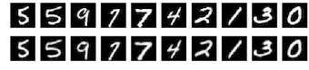
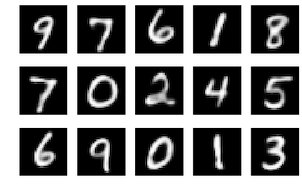
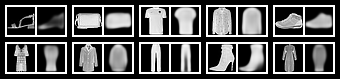
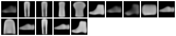
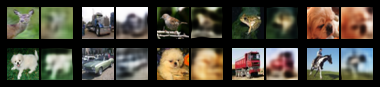
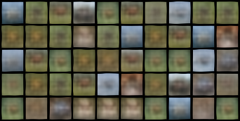

# pytorch-prototypeDL

Pytorch implementation for "Deep Learning for Case-Based Reasoning through Prototypes: A Neural Network that Explains Its Predictions"

## Requirements
- Python 3.6.1
- PyTorch 0.4.1
- Torchvision 0.2.1
- TensorboardX

## Usage

```bash
$ python train.py --help
$ usage: train.py [-h] [--mode MODE] [--data_dir DATA_DIR] [--nworkers NWORKERS]
                [--bsize BSIZE] [--shuffle SHUFFLE] [--sigma SIGMA]
                [--alpha ALPHA] [--arch ARCH] [--n_prototypes N_PROTOTYPES]
                [--decoder_arch DECODER_ARCH] [--optim OPTIM] [--lr LR]
                [--wd WD] [--momentum MOMENTUM] [--epochs EPOCHS]
                [--max_norm MAX_NORM] [--start_epoch START_EPOCH]
                [--lambda_class LAMBDA_CLASS] [--lambda_ae LAMBDA_AE]
                [--lambda_1 LAMBDA_1] [--lambda_2 LAMBDA_2]
                [--save_path SAVE_PATH] [--log_dir LOG_DIR]
                [--log_iter LOG_ITER] [--resume RESUME] [--seed SEED]
```

### 1. Training MNIST

```bash
$ python train.py --mode train_mnist --data_dir data/mnist \
	--arch small --n_prototypes 15 --decoder_arch deconv
```

#### MNIST Decoder Samples



#### MNIST Prototypes



### 2. Training Fashion-MNIST

```bash
$ python train.py --mode train_fmnist --data_dir data/fmnist \
	--arch small --n_prototypes 15 --decoder_arch upconv
```

#### Fashion-MNIST Decoder Samples



#### Fashion-MNIST Prototypes



### 3. Training CIFAR10

```bash
$ python train.py --mode train_cifar --data_dir data/cifar \
	--arch large --n_prototypes 50 --decoder_arch upconv
```

#### CIFAR10 Decoder Samples



#### CIFAR10 Prototypes



### Results

|    Dataset    | Network | Decoder Arch | # of Prototypes | Test Accuracy |                                         Notes                                         |
|:-------------:|:-------:|:------------:|:---------------:|:-------------:|:-------------------------------------------------------------------------------------:|
|     MNIST     | `small` |   `deconv`   |        15       |     0.9902    |                                          ---                                          |
|               | `small` |   `upconv`   |        15       |     0.9920    |                                          ---                                          |
| Fashion MNIST | `small` |   `deconv`   |        15       |     0.8465    |                                          ---                                          |
|               | `small` |   `upconv`   |        15       |     0.9039    |                             `--lr 6e-4` `--lambda_class 4`                            |
|    CIFAR10    | `small` |   `deconv`   |        50       |     0.6735    |                                      `--lr 6e-4`                                      |
|               | `small` |   `upconv`   |        50       |     0.6845    |                             `--lr 6e-4` `--lambda_class 5`                            |
|               | `large` |   `upconv`   |        50       |     0.7338    | `--lr 6e-4` `--lambda_class 10` `--lambda_ae 0.1` used L1 instead of MSE for AE error |